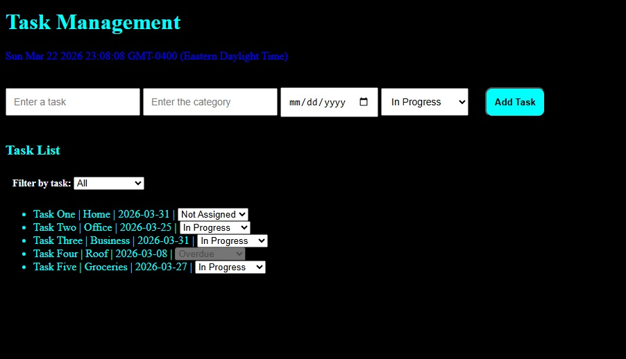

# Task Management

This task management app helps to add tasks with name, category, deadline, and status and display them in the UI. It also allows updating the task status using a dropdown and filtering tasks based on status.

### Screenshot

## Test Steps

* Enter task name, category, deadline, and select status, then click add task and check if it is displayed in the list.
* Try adding a task with empty fields and check if alert message is shown.
* Change the status from the dropdown in the UI and verify if it updates correctly.
* Select different filter options and check if only matching tasks are displayed.
* Add a task with past date and verify if it is marked as overdue and cannot be edited.
* Refresh the page and check that tasks are cleared (since local storage is not added yet).

# Reflections

### Challenges faced during the project.

* Understanding how to properly connect data (array) with the UI display was confusing at first.
* Faced issues with date comparison and status not updating correctly.
* Debugging small mistakes like variable names and event handling took time.

### How you approached solving those challenges

* Broke the problem into smaller parts and tested each step using console logs.
* Rechecked logic step-by-step and fixed issues like date handling and function calls.
* Referred to examples and corrected mistakes by comparing expected vs actual output.

### What you would improve if given more time

* Improve UI design to make it more user-friendly and visually clear.
* Optimize code to avoid re-rendering the entire list every time.
* Add more features like edit task details and better filtering options.
